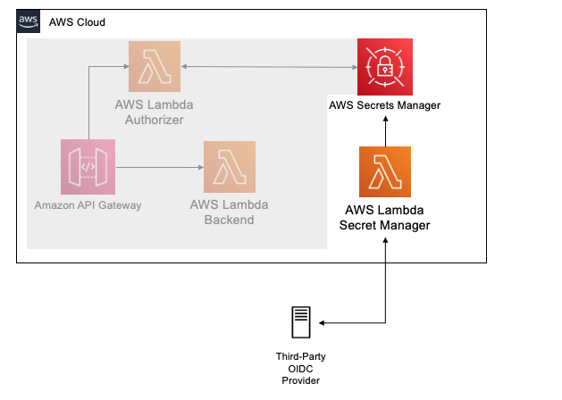
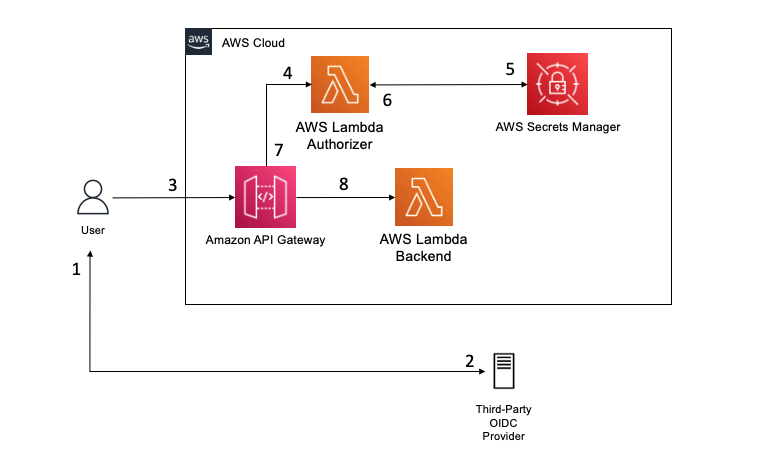

# Lambda Authorizer - OIDC Adapter

## Overview

This repo intends to create an API Gateway with a Lambda Authorizer that uses an external OIDC Provider. 


*** 

## Prerequisites:

- [awscli](https://docs.aws.amazon.com/cli/latest/userguide/cli-chap-install.html)
- [Pre configured AWS credentials](https://docs.aws.amazon.com/amazonswf/latest/developerguide/RubyFlowOptions.html)
- [npm](https://docs.npmjs.com/downloading-and-installing-node-js-and-npm)
- [cdk](https://docs.aws.amazon.com/cdk/latest/guide/getting_started.html)

## 1. How to deploy

### 1.2. Configure Environment Variables

- Open the file .env _(note that is an hidden file)_
- You will have to configure 3 items here:

| Key   |      Value      |      Description      |
|----------|:-------------:|-----------------------:|
| R53_DOMAIN_NAME | https://your-oidc.com.br/auth | Your OIDC URL |
| JWKS_URI | /openid/name/token | The URL provided by your OIDC that generate a signature. |
| SM_JWKS_SECRET_NAME |  dev/Auth/OIDC  | Name for your Secret Name that will be created in Secrets Manager |

### 1.3. Deploy the CDK Stack

```sh
cd <REPO_NAME>/resources/lambda
npm install
cd ../..
npm install
cdk deploy
```
### How it Works

There is an implicit flow, that generates the OIDC Signature in deploy time. 

When you run CDK, a AWS Lambda calls your JWKS_URI to save the OIDC Signature in the Secrets Manager. 

That signature is used to validate the token signature during all API calls. 




# Architecture



### Step by Step 

1. User accesses the OIDC provider to Authenticate (AuthN) and enter its credentials.
2. OIDC provider issues a JWT-based access and/or ID token to client.
3. User invokes a protected API resource passing the access/ID bearer token to the `Authorization` header.
4. API Gateway uses a Lambda Authorizer to decode and verify the JWT token and its scopes to allow/deny access to the protected resource.
5. Lambda Authorizer query the JWKS key for verifying the token signature stored in AWS Secrets Manager
6. Lambda Authorizer uses the retrieved key from AWS Secrets Manager to verify the token signature against the OIDC provider. 
7. In case the token is successfully verified and contains the proper scopes to access the API resource, Lambda Authorizer returns a temporary IAM credential allowing API Gateway to invoke the protected resource. 
8. API Gateway invokes the protected resource and performs an action on behalf of the user.

## 2. Test Your Application 

To test the solution, we are going to use the Keycloak as OIDC Provider. 
To Deploy Keycloak independly in your AWS Account, follow: <<repo>>

### 2.1. Terminal - Invoke your API
First, use terminal to run the following command to invoke your API without any JWT token:

```sh
curl -X GET https://<API-ID>.execute-api.<REGION>.amazonaws.com/prod/
```
You should get the following error message with a `401 HTTP Status Code`:

`"message": "Unauthorized"`

Or the following error message with a `403 HTTP Status Code` in case you pass an invalid `Bearer` token:

`"Message": "User is not authorized to access this resource with an explicit deny"`

### 2.2.  Generate your JWT Token
*Remember, we are using Keycloak as OIDC Provider*

```sh
token=$(curl -X POST 'https://<<YOUR-DOMAIN>>/auth/realms/master/protocol/openid-connect/token' -H "Content-Type: application/x-www-form-urlencoded" -d "username=keycloak" -d "password=<<YOUR-PASSWORD>>" -d "grant_type=password" -d 'client_id=admin-cli' |jq -r '.access_token') 
```

### 2.3. Terminal - Invoke your API passing your JWT as Authorization Header

Let's try once again, this time including the `Authorization` header in our request together with our newly issued JWT token.

```sh
curl -X GET https://<API-ID>.execute-api.<REGION>.amazonaws.com/prod/ -H "Authorization: Bearer ${token}"
```

Now, you should get the following message with a `200 HTTP Status Code`:

`Hello From Authorized API`

Congratulations! You have now configured your API Gateway to authorize access based on JWT-based tokens issued by an external FAPI-compliant OIDC Provider.

## 3. Cleaning UP

Run the following command:

```sh
cdk destroy
```

## 4. Security

See [CONTRIBUTING](CONTRIBUTING.md#security-issue-notifications) for more information.

## 5. License

This library is licensed under the MIT-0 License. See the LICENSE file.
